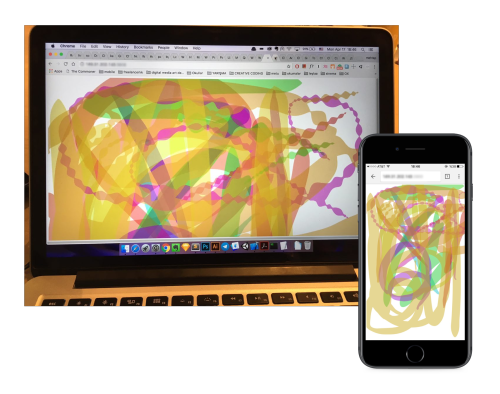

# Assignment 03

**Real Time Application**

## Inspiration
- [Racer/Chrome Experiment] (https://www.chromeexperiments.com/experiment/racer)
- [Yellow Tails/Chrome Experiment ] (https://www.chromeexperiments.com/experiment/yellow-tail)

## Submission Details
Using Socket.io, Node.js and Paper.js I tried to create a collaborative drawing experience. 

## Running
- $> npm install
- $> node app.js

## Screen

## My Resources
- Daniel Shiffman (https://www.youtube.com/watch?v=i6eP1Lw4gZk)
- Building Multiplayer Games with Node.js and Socket.IO (https://modernweb.com/building-multiplayer-games-with-node-js-and-socket-io/)
- HTML5 - WebSockets (https://www.tutorialspoint.com/html5/html5_websocket.htm)
- WebSockets Tutorial (https://www.tutorialspoint.com/websockets/index.htm)
- Socket.io Documentation (https://socket.io/docs/client-api/)
- Paper.js examples and documentation http://paperjs.org/
